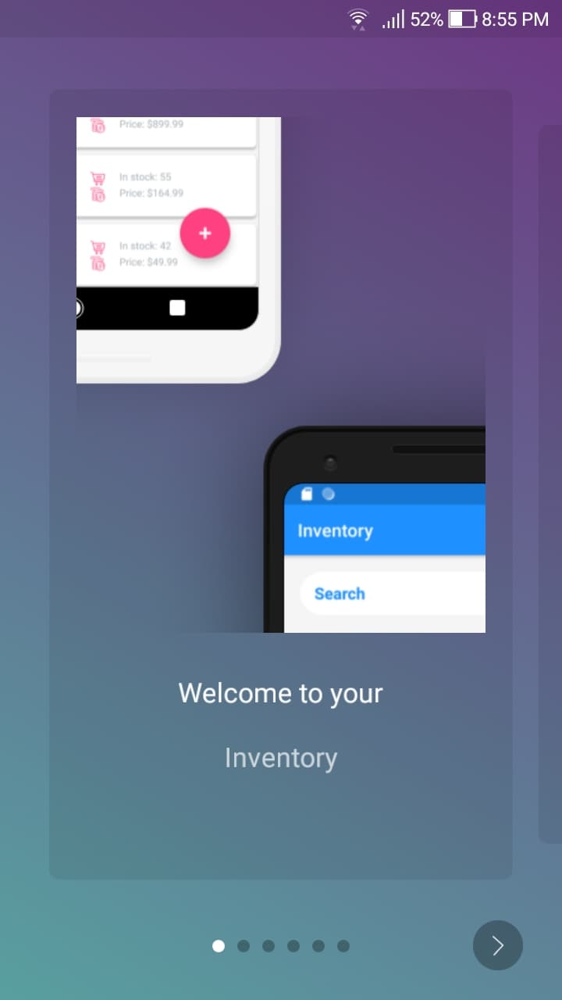
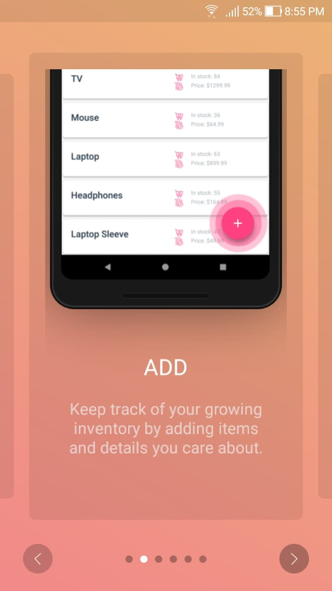
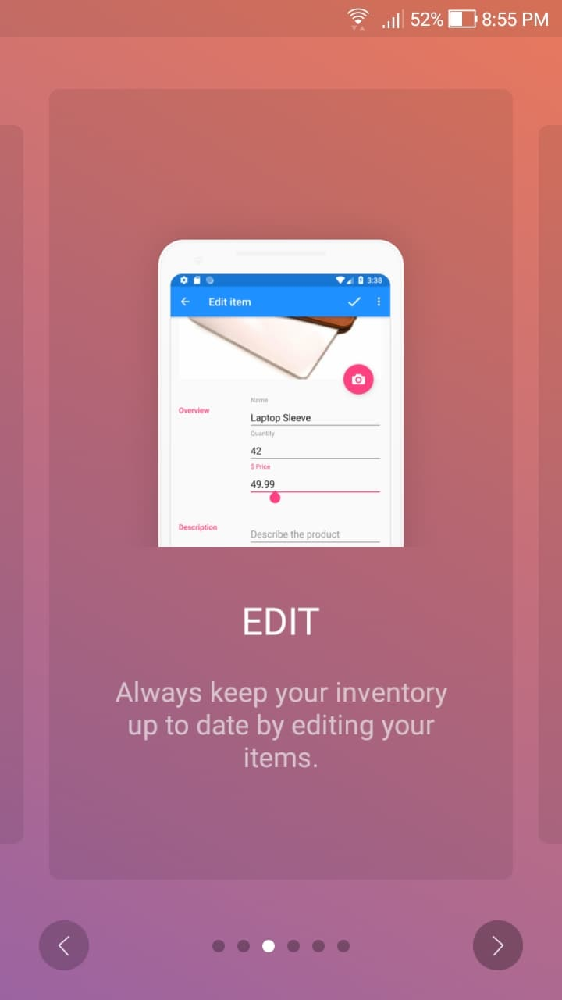
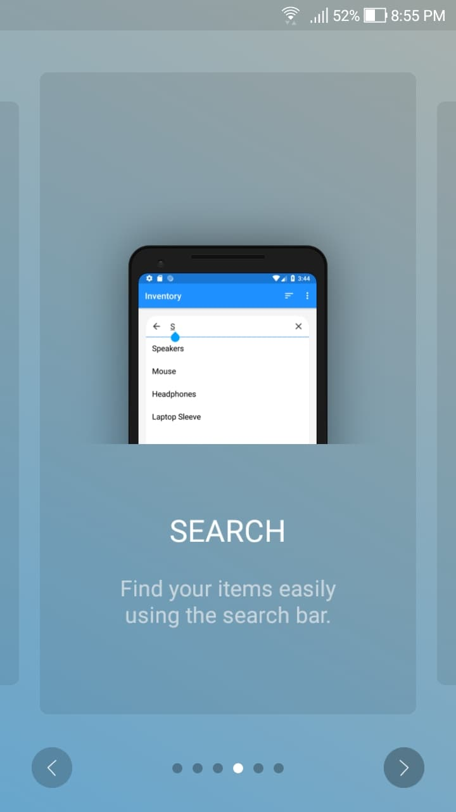
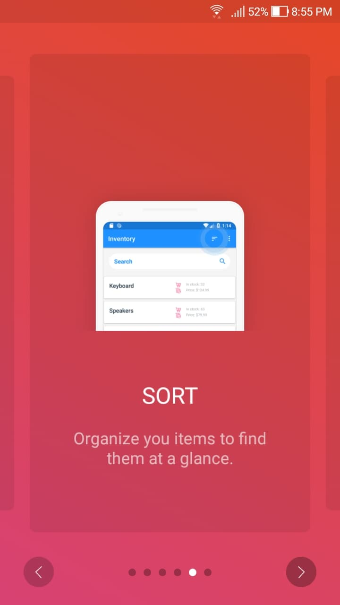
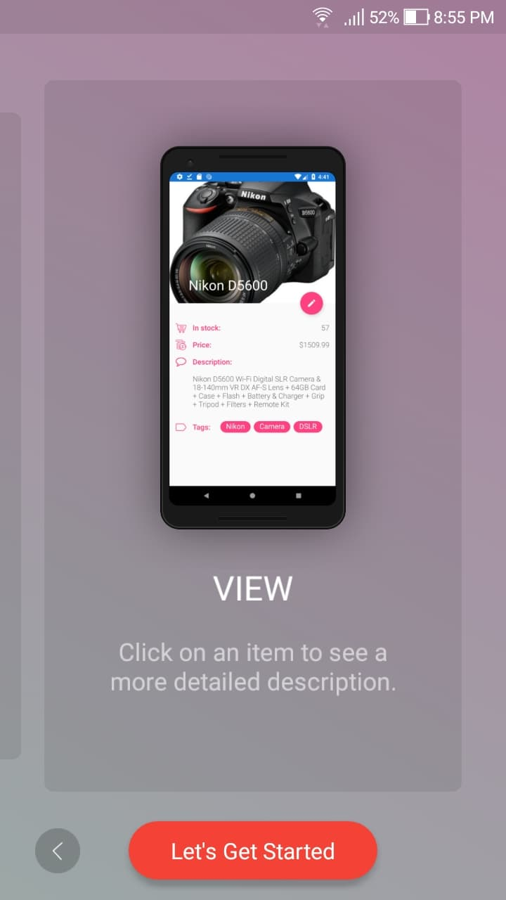

# Inventory for Android

## Description

Welcome to Inventory, a simple Android application to manage your inventory! Add items to your inventory to view them in your catalogue. Click on an item or search for it in the search bar to get additional information and edit it. Sort your catalogue to find items at a glance. Feel free to delete any item any time.  


## Features
- **Search Bar**  
 Make use of the powerful search bar to search for any item by name. Search suggestions help predict your search so you dont have to type out the whole name. Simply click on an item or press the search button to receive detailed product infromation about the item.
- **Customizable data entries**  
  Add and edit items at any time. Fill in as much information as necessary such as name, price, quantity and even a product description. Add relevant tags to your products as you see fit. 
- **Data sorting**  
  Use the sort button to change how you want to view your database. Sort items alphabetically or by their order of addition into the database.
- **Database storage**  
  With the help of SQLite3 database, you can add, delete and edit any number of items and keep them saved securely on your device. Additional safety checks provided allow you to confirm before changing or permanently deleting anything from your database.
- **Material Design**  
  Material Design allows manipulating database to be more intuitive than ever. Everything from the colour scheme to iconography enhances the user's experience and allows for changes to be quick and easy. Updating your database doesn't have to be intimidating.

   

  

## Coming Soon

- Search by tags
- Sort by price
- Revenue calculator
- Different colour themes

## Dependencies

'org.apmem.tools:layouts:1.10@aar'  
'com.android.support:recyclerview-v7:27.1.1'  
'com.readystatesoftware.sqliteasset:sqliteassethelper:+'  
'com.github.mancj:MaterialSearchBar:0.7.6'  
'com.codemybrainsout.onboarding:onboarder:1.0.4'  

## SDK
 - Compile SdkVersion 27
 - minSdkVersion 21
 - targetSdkVersion 27
 
 ## Database
 
 This application uses SQLite3 database.
 
 ## Downloading
 
 Check latest release to download the apk file.  
 https://github.com/gerin98/inventory/releases/tag/3.0.1
 
 ## Resources

 <div>Icons made by <a href="https://www.flaticon.com/authors/dave-gandy" title="Dave Gandy">Dave Gandy</a> from <a href="https://www.flaticon.com/" title="Flaticon">www.flaticon.com</a> is licensed by <a href="http://creativecommons.org/licenses/by/3.0/" title="Creative Commons BY 3.0" target="_blank">CC 3.0 BY</a></div>
 
 <div>Icons made by <a href="http://www.freepik.com" title="Freepik">Freepik</a> from <a href="https://www.flaticon.com/" title="Flaticon">www.flaticon.com</a> is licensed by <a href="http://creativecommons.org/licenses/by/3.0/" title="Creative Commons BY 3.0" target="_blank">CC 3.0 BY</a></div>
  
 <div>Icons made by <a href="https://www.flaticon.com/authors/gregor-cresnar" title="Gregor Cresnar">Gregor Cresnar</a> from <a href="https://www.flaticon.com/" title="Flaticon">www.flaticon.com</a> is licensed by <a href="http://creativecommons.org/licenses/by/3.0/" title="Creative Commons BY 3.0" target="_blank">CC 3.0 BY</a></div>
 
 # License
 
 ```
Copyright 2018 Gerin Amalaraj

Licensed under the Apache License, Version 2.0 (the "License");
you may not use this file except in compliance with the License.
You may obtain a copy of the License at

    http://www.apache.org/licenses/LICENSE-2.0

Unless required by applicable law or agreed to in writing, software
distributed under the License is distributed on an "AS IS" BASIS,
WITHOUT WARRANTIES OR CONDITIONS OF ANY KIND, either express or implied.
See the License for the specific language governing permissions and
limitations under the License.

```
